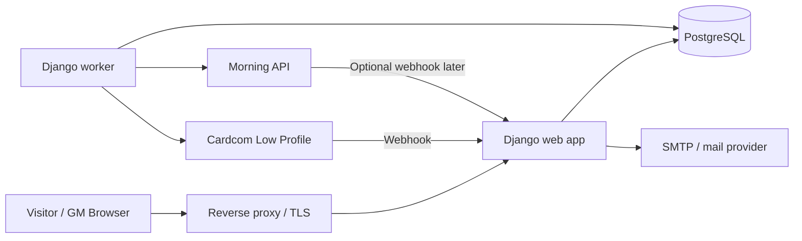

# Center LARP Registration Site — PRD, Technical Spec, and DevOps Handoff

**Prepared for:** development and devops teams  
**Prepared on:** 2026-03-25  
**Primary domain:** `center.larp.co.il`  
**Recommended stack:** Python 3.14 + Django 5.2 LTS + PostgreSQL  
**Deployment target:** existing DigitalOcean Docker infrastructure

---

## 1. Decision summary

Build one small Django application and deploy it on the existing DigitalOcean / Docker stack.

Use the following architecture:

- public landing page + application form
- Django admin as the GM backoffice
- PostgreSQL as the source of truth
- Cardcom Low Profile for hosted payment pages
- Morning for accounting documents
- one web process and one worker process
- no player accounts in v1
- no CMS in v1
- no Redis requirement in v1

### Why this is the chosen option

- fastest path to production with minimal front-end work
- avoids WordPress plugin glue code for approval-first payment flow
- avoids GitHub Pages limitations and split hosting
- keeps the workflow stateful and auditable
- fits existing DigitalOcean / Docker operational habits
- keeps the landing page visually close to the supplied HTML reference

### Architectural rule of record

- **Cardcom** is the source of truth for payment status after server-side verification.
- **Morning** is the source of truth for accounting documents.
- The app itself is the source of truth for workflow state and roster publication flags.

---

## 2. Product brief (PRD)

### 2.1 Product summary

A simple event site for a short LARP that lets visitors read the event page, apply, wait for GM approval, pay through a hosted Cardcom payment page if approved, receive a Morning document after payment, and appear on an online roster according to GM visibility rules.

### 2.2 Goals

- Launch a single-event site quickly.
- Preserve the look and feel of the supplied landing page.
- Keep the workflow approval-first, not checkout-first.
- Give GMs a usable backoffice without building a custom dashboard.
- Prevent duplicate payments / duplicate invoices through idempotent workflow handling.
- Keep public roster information intentionally limited.

### 2.3 Non-goals

- No full CMS in v1.
- No player login area in v1.
- No multi-event self-service platform in v1.
- No self-service refunds or cancellations in v1.
- No custom GM dashboard unless the team explicitly wants it later.

### 2.4 Users

#### Visitor / applicant
- reads the landing page
- submits the application form
- receives confirmation email
- receives a payment link only after approval
- receives an accounting document after successful verified payment

#### GM
- reviews applications
- approves / rejects applications
- writes internal notes
- creates and resends payment links
- publishes or unpublishes players on the public roster
- independently toggles character and faction visibility
- retries integration actions when needed

#### Dev / DevOps
- manages config, deployments, secrets, logs, backups, and operational alerts

### 2.5 Core business rules

1. Landing page stays visually close to `foreign_gates_v4.html`.
2. Form submission creates an application record.
3. Payment links are sent **only** after GM approval.
4. Payment completion is **not** trusted from the browser redirect alone.
5. Payment is marked successful only after server-side verification against Cardcom.
6. Morning document creation happens only after verified payment.
7. Internal roster shows workflow state.
8. Public roster never shows paid status.
9. Character and faction are public only if GMs explicitly toggle them on.

### 2.6 Success criteria

- Application intake works on desktop and mobile.
- GM team can operate entirely through `/gm/`.
- Cardcom and Morning integrations work in sandbox and production.
- Duplicate webhook deliveries do not create duplicate side effects.
- Public roster is safe by default and publishes only deliberate fields.
- Deployment is small enough to maintain without introducing a new platform.

---

## 3. Scope and UX

### 3.1 Public pages

#### `/`
Landing page.

Requirements:
- preserve the overall section structure and tone of the supplied HTML reference
- keep RTL Hebrew support
- replace CTA target with `/apply/`
- event metadata should come from event configuration, not hardcoded page text

#### `/apply/`
Application form.

Requirements:
- same visual language as landing page
- no login required
- strong server-side validation
- honeypot anti-spam field
- confirmation after successful submission

#### `/apply/thanks/`
Submission confirmation page.

#### `/pay/<token>/`
Safe internal redirect endpoint that resolves the current active payment attempt and redirects to Cardcom.

#### `/payment/return/success/`
Human-facing page that says payment was received and is being verified.

#### `/payment/return/failure/`
Human-facing page for failed / cancelled payment attempts.

#### `/players/`
Public roster.

Requirements:
- no paid status
- no private notes
- no email or phone
- display name always shown once published
- character shown only if `show_character_publicly = true`
- faction shown only if `show_faction_publicly = true`

### 3.2 Internal pages

#### `/gm/`
Django admin, used as the GM control panel.

Recommended admin capabilities:
- search by name/email/phone
- list filters for each status
- approve / reject actions
- generate payment link
- resend payment link
- reconcile payment
- retry Morning document creation
- publish / unpublish roster entry
- toggle character visibility
- toggle faction visibility

### 3.3 Accessibility and usability

- Hebrew RTL on public pages
- accessible labels and inputs on the application form
- no giant walls of text on GM screens
- readable emails
- mobile-friendly public pages
- simple status language in admin list views

---

## 4. Runtime stack

### 4.1 Chosen technologies

- **Python:** 3.14
- **Framework:** Django 5.2 LTS
- **DB:** PostgreSQL 16+
- **HTTP server:** Gunicorn behind existing reverse proxy
- **Reverse proxy:** existing Nginx / Traefik / Caddy layer on DigitalOcean
- **Background processing:** Django worker process with DB-backed outbox
- **Emails:** SMTP or existing transactional mail provider
- **Frontend:** Django templates + small amount of vanilla JS

### 4.2 Why Django for this project

- built-in admin removes the need for a custom GM dashboard
- ORM and admin are good matches for the stateful approval workflow
- templates are enough for the mostly static public pages
- good fit for PostgreSQL JSON fields and straightforward operational model
- Python 3.14 is supported in Django 5.2 as of 5.2.8 [R1]

### 4.3 Queue / jobs recommendation

Default:
- DB-backed outbox + worker management command

Allowed deviation:
- if the team already operates Redis and Celery comfortably, it can be swapped in without changing the external product behavior

Reason:
- v1 traffic is low
- avoids adding Redis solely for this project
- keeps deployment smaller

---

## 5. High-level architecture



### 5.1 Services

#### Web app
Responsibilities:
- render public pages
- accept form submissions
- serve Django admin
- accept vendor webhooks
- enqueue jobs
- expose health endpoints

#### Worker
Responsibilities:
- process integration events
- verify Cardcom payments
- create Morning documents
- send app-originated emails
- retry failed tasks safely

#### PostgreSQL
Responsibilities:
- source of truth for applications, payment attempts, documents, audit logs, and jobs

---

## 6. Repo structure recommendation

```text
repo/
  manage.py
  config/
    settings/
      base.py
      local.py
      production.py
    urls.py
    wsgi.py
    asgi.py
  apps/
    public_site/
    applications/
    payments_cardcom/
    billing_morning/
    notifications/
    audit/
    jobs/
  templates/
  static/
  event_config/
    current_event.yaml
    application_form.yaml
  ops/
    Dockerfile
    docker-compose.yml
    nginx.center.larp.co.il.conf
    deployment-checklist.md
  requirements/
    base.txt
    production.txt
```

### 6.1 Django apps

#### `public_site`
- landing page
- thank-you pages
- public roster

#### `applications`
- form rendering
- validation
- application models
- admin configuration

#### `payments_cardcom`
- payment attempts
- payment-link creation
- Cardcom webhook intake
- reconciliation service

#### `billing_morning`
- document records
- Morning service wrapper
- retry / reconciliation hooks

#### `notifications`
- email templates and sending

#### `audit`
- audit log model and helpers

#### `jobs`
- DB-backed outbox / job runner

---

## 7. Data model

### 7.1 Event

Purpose:
- holds event-level configuration and text that should not be hardcoded into templates

Fields:
- `id`
- `slug`
- `title`
- `subtitle`
- `location_text`
- `start_at`
- `end_at`
- `price_amount`
- `currency` (`ILS`)
- `registration_open`
- `public_roster_enabled`
- `morning_document_type` (`305`, `320`, `400`)
- `cardcom_language` (`he`)
- `landing_template`
- `created_at`
- `updated_at`

### 7.2 Application

Purpose:
- source of truth for a player’s lifecycle through the application, approval, payment, document, and roster pipeline

Fields:
- `id`
- `public_id` (UUID safe to expose)
- `event_id`
- `full_name`
- `display_name`
- `email`
- `phone`
- `answers_json` (JSONB)
- `form_version`
- `gm_status` (`submitted`, `approved`, `rejected`)
- `payment_status` (`not_requested`, `link_created`, `link_sent`, `paid`, `failed`, `expired`, `waived`)
- `invoice_status` (`not_created`, `queued`, `created`, `emailed`, `failed`)
- `is_publicly_published`
- `show_character_publicly`
- `show_faction_publicly`
- `public_character_name`
- `public_faction_name`
- `gm_notes`
- `submitted_at`
- `approved_at`
- `rejected_at`
- `paid_at`
- `published_at`
- `created_at`
- `updated_at`

### 7.3 PaymentAttempt

Purpose:
- represents a single payment link / payment attempt

Fields:
- `id`
- `public_id` (UUID; used in Cardcom `ReturnValue`)
- `application_id`
- `amount`
- `currency`
- `vendor` (`cardcom`)
- `vendor_low_profile_id`
- `payment_url`
- `status` (`created`, `sent`, `paid`, `failed`, `expired`, `invalidated`)
- `raw_create_response_json`
- `raw_getlpresult_json`
- `created_at`
- `sent_at`
- `paid_at`
- `invalidated_at`

Constraints:
- only one active payment attempt per application at a time
- one payment attempt can produce at most one Morning document

### 7.4 Document

Purpose:
- stores the Morning document created after successful payment

Fields:
- `id`
- `application_id`
- `payment_attempt_id`
- `vendor` (`morning`)
- `document_type`
- `vendor_document_id`
- `document_number`
- `status` (`queued`, `created`, `emailed`, `failed`)
- `raw_response_json`
- `created_at`
- `emailed_at`
- `updated_at`

Constraint:
- unique on `payment_attempt_id`

### 7.5 IntegrationEvent

Purpose:
- stores raw vendor payloads for traceability and replay-safe processing

Fields:
- `id`
- `source` (`cardcom`, `morning`)
- `event_type`
- `dedupe_key`
- `payload_json`
- `processing_status` (`pending`, `processing`, `done`, `failed`)
- `error_message`
- `received_at`
- `processed_at`

Constraint:
- unique on `source + dedupe_key`

### 7.6 AuditLog

Purpose:
- trace important GM and system actions

Fields:
- `id`
- `actor_type` (`gm`, `system`)
- `actor_label`
- `action`
- `target_type`
- `target_id`
- `details_json`
- `created_at`

### 7.7 Job / Outbox table

Purpose:
- drive background work without Redis

Fields:
- `id`
- `queue_name`
- `job_type`
- `payload_json`
- `dedupe_key`
- `status` (`queued`, `processing`, `done`, `failed`)
- `attempt_count`
- `available_at`
- `locked_at`
- `last_error`
- `created_at`
- `updated_at`

Constraint:
- unique on `dedupe_key` where relevant

---

## 8. State model and business rules

### 8.1 GM state

- `submitted`
- `approved`
- `rejected`

Transitions:
- `submitted -> approved`
- `submitted -> rejected`

No automatic transition from rejected back to approved without deliberate GM action.

### 8.2 Payment state

- `not_requested`
- `link_created`
- `link_sent`
- `paid`
- `failed`
- `expired`
- `waived`

Important rules:
- approval does not mark payment requested automatically unless the GM action also creates a link
- browser return page does not mark payment as paid
- payment becomes `paid` only after Cardcom verification
- duplicate vendor callbacks must not create duplicate side effects

### 8.3 Invoice state

- `not_created`
- `queued`
- `created`
- `emailed`
- `failed`

Important rules:
- one payment attempt -> at most one document
- if document creation fails, the app stays paid but invoice status becomes `failed`
- GMs can retry invoice creation

### 8.4 Publication state

- unpublished by default
- GM can publish once the application is approved, paid, or at any policy point the team chooses
- public character and faction are independent toggles

---

## 9. Configuration strategy

### 9.1 Event config

Use a repo-managed YAML file for event metadata and page text fragments.

Why:
- lets the team edit event details without migrations
- works well for a single-event site
- keeps templates generic

See `config/current_event.example.yaml`.

### 9.2 Form schema

Use a repo-managed YAML file for the application form.

Why:
- final field list is still open
- avoids migration churn while questions are being finalized
- lets public form render from config but still stores normalized contact fields separately

See `config/application_form.example.yaml`.

---

## 10. Routes and permissions

| Route | Purpose | Auth | Notes |
|---|---|---:|---|
| `/` | landing page | public | RTL Hebrew |
| `/apply/` | application form | public | GET + POST |
| `/apply/thanks/` | confirmation page | public | no secrets |
| `/pay/<token>/` | safe redirect to Cardcom | public | resolves active attempt |
| `/payment/return/success/` | return page | public | informational only |
| `/payment/return/failure/` | return page | public | informational only |
| `/players/` | public roster | public | no paid status |
| `/gm/` | Django admin | staff | mount admin here |
| `/webhooks/cardcom/low-profile/` | Cardcom webhook | vendor | CSRF exempt |
| `/webhooks/morning/document-created/` | optional future webhook | vendor | CSRF exempt |
| `/health/live/` | liveness | internal/public | cheap |
| `/health/ready/` | readiness | internal/public | DB reachable |

Recommended hardening:
- protect `/gm/` with strong auth and, if practical, IP allowlisting or VPN
- keep health endpoints simple and non-sensitive

---

## 11. Landing page implementation notes

### 11.1 Visual approach

Start from the supplied `foreign_gates_v4.html` and preserve:
- typography hierarchy
- dark / moody palette
- narrow centered layout
- logistics strip
- faction cards
- about section
- CTA section

Required code changes:
- replace inline CTA link target with `/apply/`
- move inline CSS into versioned static files
- parameterize event metadata and CTA text
- keep fonts and color tokens configurable if the team wants later tweaks

### 11.2 Content ownership

Recommended split:
- page structure in Django template
- event-specific copy in YAML
- no admin CMS in v1

---

## 12. Application form

### 12.1 Normalized fields

Always store separately:
- full name
- display name
- email
- phone

Why:
- these are needed for payment and communication
- the public roster uses display name
- the integrations need stable contact fields

### 12.2 Dynamic fields

All other event-specific responses go into `answers_json`.

### 12.3 Validation rules

- required fields enforced server-side
- email format validated
- phone required by policy
- honeypot field must be empty
- optional per-IP rate limiting at app or proxy layer
- duplicate submissions from same email are allowed only if team policy permits; otherwise soft-block and tell applicant to contact organizers

### 12.4 Emails on submit

App should send:
- confirmation email to applicant
- notification email to GM inbox / mailing list

---

## 13. GM workflow

### 13.1 Minimal admin UX

Django admin should be enough in v1 if the following are configured:

- filtered list views
- searchable fields
- custom admin actions
- inline read-only integration objects
- readable status badges
- separate sections for public visibility flags

### 13.2 Required GM actions

- approve application
- reject application
- add / edit internal notes
- create payment link
- resend payment link
- invalidate current payment link
- manually reconcile payment
- retry document creation
- publish / unpublish public roster entry
- toggle character visibility
- toggle faction visibility

### 13.3 Recommended policy defaults

- approved applications do not auto-publish
- only one active payment link at a time
- public character/faction toggles default to off
- payment resend invalidates older active link if a new one is created

---

## 14. Cardcom integration contract

### 14.1 Chosen model

Use **Cardcom Low Profile** only for the web payment flow [R2][R3].

Do not use direct card capture on your site.

### 14.2 Why

Cardcom’s official docs state that direct interface charging is not intended for web sites and that website flows should use Low Profile [R3].

### 14.3 App-level service interface

```python
class CardcomService:
    def create_payment_page(self, application, amount_ils: int | float) -> PaymentAttempt: ...
    def verify_payment(self, low_profile_id: str) -> dict: ...
```

### 14.4 Create payment page flow

1. GM clicks “Generate payment link”.
2. App creates `PaymentAttempt`.
3. App sets `PaymentAttempt.public_id` as the Cardcom `ReturnValue`.
4. App calls `POST /api/v11/LowProfile/Create`.
5. App stores:
   - Cardcom LowProfileId
   - hosted payment URL
   - raw vendor response
6. App emails the player a safe site URL:
   - `https://center.larp.co.il/pay/<payment_attempt.public_id>/`
7. Internal payment state becomes `link_sent`.

### 14.5 Recommended request shape

The team should validate the final field names against the live Cardcom doc at implementation time, but the request should conceptually include:

- terminal number
- API name
- operation = `ChargeOnly`
- amount
- `ReturnValue`
- hosted page language = Hebrew
- success redirect URL
- failure redirect URL
- webhook URL
- optional UI defaults:
  - full name
  - email
  - phone
  - required flags for contact fields

### 14.6 Why `/pay/<token>/` exists

Do not email the raw Cardcom URL directly.

Benefits:
- lets the app invalidate or rotate attempts
- keeps vendor URLs out of organizer messaging templates
- lets the app log link opens if useful
- gives a stable site-owned link

### 14.7 Webhook and verification flow

Cardcom webhook endpoint behavior:
1. receive payload
2. persist raw event in `IntegrationEvent`
3. return HTTP 200 quickly
4. enqueue reconciliation job

Worker behavior:
1. take the vendor `LowProfileId`
2. call Cardcom `GetLpResult`
3. verify success (`ResponseCode == 0`) [R2]
4. locate `PaymentAttempt` using `ReturnValue`
5. if already paid, exit idempotently
6. mark `PaymentAttempt` and `Application` as paid
7. enqueue Morning document creation job
8. write audit log

### 14.8 Idempotency rules

- unique dedupe key for webhook event
- `PaymentAttempt.status = paid` is terminal for that attempt
- document creation keyed uniquely by `payment_attempt_id`
- manual retries must be safe

### 14.9 Important vendor behaviors to respect

Per Cardcom docs [R2]:
- use a public external URL; `localhost` is not supported
- do not trust success page alone
- verify server-side with `GetLpResult`
- Cardcom retries the transaction report if no HTTP 200 is returned

---

## 15. Morning integration contract

### 15.1 Chosen role

Morning is used to generate the accounting document after verified payment.

### 15.2 Access and environments

Morning API access is available on Best and up, the API secret is shown only once at creation, and sandbox is available for testing [R4].

### 15.3 App-level service interface

```python
class MorningBillingService:
    def create_document(self, application, payment_attempt) -> dict: ...
    def get_document(self, vendor_document_id: str) -> dict: ...
```

### 15.4 Document type choice

Default recommendation:
- `320` — tax invoice / receipt

Possible alternatives:
- `305` — tax invoice
- `400` — receipt

Final choice should be confirmed with the accountant / bookkeeping policy [R6].

### 15.5 Internal field mapping

The app should map to Morning using these source fields:

#### Recipient / customer
- application full name
- application email
- application phone
- optional address fields only if collected

#### Line item
- event title
- quantity = 1
- price = event price
- currency = ILS
- description = event name + optional application / payment reference

#### Payment reference
- Cardcom transaction identifiers from verified result
- internal application UUID
- internal payment attempt UUID

### 15.6 Important note on exact API request shape

The public docs clearly confirm:
- Morning API access exists for Best+ [R4]
- webhooks exist and require HTTPS [R5]
- document types include 305 / 320 / 400 [R6]
- Morning can send documents by email from the system [R7]

However, this package intentionally does **not** lock in an exact vendor request body for Morning document creation, because the accessible public pages do not fully expose the current live create-document endpoint schema. Implementation should read the live API docs at start of build and then code the request shape there.

This is an implementation checkpoint, not a blocker.

### 15.7 Emailing the document

Target behavior:
- after document creation, the player receives the Morning document by email

Implementation options:
1. use Morning’s document-create flow if it supports send-on-create in the live API docs
2. otherwise create the document and trigger the send action in a second API call
3. otherwise use Morning’s automatic email behavior for saved clients if operationally acceptable

### 15.8 Optional webhook

Morning’s `document/created` webhook can be used later for additional reconciliation / observability, but it is not required for v1 if the create-document API response already gives enough confirmation.

---

## 16. Notifications and emails

### 16.1 App-originated emails

The Django app should send:
- application received
- new application alert to GMs
- rejection email
- payment link email
- payment reminder / resend email
- internal alert on invoice failure

### 16.2 Morning-originated email

Morning should send:
- final accounting document email to the player

### 16.3 Email template guidance

Keep templates plain and reliable:
- simple Hebrew copy
- site domain and contact email visible
- no vendor raw links in user-facing templates
- include event name and application reference when useful

---

## 17. Public and internal roster behavior

### 17.1 Internal roster

Should show:
- applicant identity
- GM decision
- payment status
- invoice status
- public visibility flags
- links to payment attempts and documents
- timestamps
- notes

### 17.2 Public roster

Should show only:
- display name
- optional character name
- optional faction name

Must never show:
- paid status
- email
- phone
- internal notes
- invoice information
- payment identifiers

### 17.3 Sort order

Default:
- alphabetical by display name

Optional future enhancement:
- explicit GM-controlled public order

---

## 18. Security, privacy, and compliance

### 18.1 Payment handling

- no card data is stored or processed by the app
- payment is completed on Cardcom-hosted pages [R2][R3]
- verification happens server-side

### 18.2 Admin hardening

Recommended:
- strong passwords
- 2FA if your auth stack supports it
- IP allowlist or VPN access for `/gm/` if practical
- no staff credentials shared between GMs

### 18.3 Webhooks

- separate CSRF-exempt webhook routes
- verify Morning webhook secret if that webhook is enabled [R5]
- do not trust Cardcom callback payload as final truth; always verify against `GetLpResult` [R2]

### 18.4 Data minimization

Collect only what is required for:
- GM approval
- payment link delivery
- accounting document creation
- optional public roster display

### 18.5 Auditability

Log these actions:
- application submitted
- GM approved / rejected
- payment link created / sent
- Cardcom webhook received
- Cardcom payment verified
- Morning document created / failed
- public roster visibility changed

---

## 19. DevOps runbook

### 19.1 Deployment topology

Recommended containers:
- `web`
- `worker`
- `db` (only if not using an existing shared PostgreSQL instance)

Optional:
- `pgbouncer` if already standard in your infra
- no Redis required in default plan

### 19.2 Reverse proxy

Terminate TLS at the existing reverse proxy.

Reverse proxy responsibilities:
- route `center.larp.co.il` to the Django `web` container
- serve `/static/` efficiently
- optional rate limiting for `/apply/`
- forward original scheme and host headers

### 19.3 Health checks

Required endpoints:
- `/health/live/` -> returns 200 if process is alive
- `/health/ready/` -> returns 200 only if DB is reachable

### 19.4 Logging

- JSON logs to stdout
- structured fields for request ID, application ID, payment attempt ID, vendor source, event type, and job type
- shipping to existing centralized log stack if available

### 19.5 Monitoring

Alert at minimum on:
- repeated webhook failures
- repeated Morning document failures
- worker stopped
- database unavailable
- abnormal 5xx rate
- disk pressure on DB host if self-managed

### 19.6 Backups

If using dedicated PostgreSQL:
- daily backup
- at least one tested restore flow
- backup retention policy consistent with existing infra

### 19.7 Secrets

Keep in secret management or environment variables:
- Django secret key
- database URL
- SMTP credentials
- Cardcom terminal / API credentials
- Morning API credentials
- optional Morning webhook secret

Do not commit vendor secrets to git.

---

## 20. Example environment variables

See `ops/.env.example` for the working list.

Minimum required:
- `DJANGO_SECRET_KEY`
- `DJANGO_ALLOWED_HOSTS`
- `DATABASE_URL`
- `APP_BASE_URL`
- `EMAIL_HOST`
- `EMAIL_PORT`
- `EMAIL_HOST_USER`
- `EMAIL_HOST_PASSWORD`
- `DEFAULT_FROM_EMAIL`
- `CARDCOM_TERMINAL_NUMBER`
- `CARDCOM_API_NAME`
- `CARDCOM_LOW_PROFILE_URL`
- `CARDCOM_GET_LP_RESULT_URL`
- `MORNING_ENV`
- `MORNING_API_KEY_ID`
- `MORNING_API_SECRET`

---

## 21. Example Docker layout

See:
- `ops/Dockerfile.example`
- `ops/docker-compose.example.yml`
- `ops/nginx.center.larp.co.il.example.conf`

Important notes:
- keep web and worker images identical
- run migrations before promoting new release
- ensure worker is deployed together with web
- static asset collection should happen in build or release step

---

## 22. Implementation plan

### Phase 0 — Project scaffold
- create repo
- scaffold Django project
- add settings split
- add PostgreSQL connection
- add base models and admin auth
- add CI checks

### Phase 1 — Public site
- port landing page from supplied HTML
- add event config loader
- add application form renderer
- build submit + confirmation flow
- send submit emails

### Phase 2 — GM workflow
- register models in admin
- add list filters and search
- add approve / reject actions
- add roster publication toggles
- add audit logging

### Phase 3 — Cardcom integration
- build `PaymentAttempt`
- create payment page service
- add `/pay/<token>/`
- add Cardcom webhook endpoint
- add worker reconciliation
- test duplicate callback handling

### Phase 4 — Morning integration
- build `Document`
- add Morning service wrapper
- create document on verified payment
- expose retry actions in admin
- confirm email-send behavior against live API docs

### Phase 5 — Public roster and hardening
- add public roster page
- add visibility rules
- add health checks
- add rate limiting
- finalize logs and alerts
- run sandbox and production cutover checklist

---

## 23. Acceptance criteria

### Functional
- landing page matches the supplied HTML’s overall structure and style
- application submission creates an admin-visible record
- GM can approve and reject
- GM can create and resend payment links
- Cardcom callback alone does not mark payment as paid
- verified payment produces exactly one paid state transition
- verified payment produces at most one Morning document
- public roster hides paid state
- public roster shows character and faction only when toggled on

### Operational
- web and worker both start cleanly in Docker
- health endpoints work
- logs are structured
- secrets are externalized
- backups are configured if DB is managed by this project
- sandbox end-to-end test passes before production cutover

### Security / privacy
- no card data touches the app
- admin is protected
- public roster exposes only approved public fields
- webhooks are isolated and replay-safe

---

## 24. Known open items

These are not blockers for starting implementation, but they must be closed before go-live.

1. **Final application form schema**
   - exact questions
   - validation rules
   - whether address / ID fields are needed for Morning

2. **Final Morning document type**
   - default package recommendation is `320`
   - accounting owner should confirm whether that is correct

3. **Exact live Morning API request shape**
   - document creation request body
   - whether send-by-email can happen in the same API call
   - whether a second API call is required

4. **GM notification target**
   - one mailbox
   - mailing list
   - or webhook / chat bridge

---

## 25. Implementation guidance for the dev team

### 25.1 Keep v1 small

The fastest path is:
- Django templates
- Django admin
- DB-backed jobs
- YAML-configured form
- no SPA
- no custom CMS

### 25.2 Resist premature platformization

This is a single-event site.
Do not build:
- a generic event builder
- a general workflow designer
- a player portal
- a full custom admin dashboard

### 25.3 Prefer explicit code over magic plugins

Especially for:
- payment state transitions
- idempotency checks
- Morning document creation
- roster visibility rules

---

## 26. References

Use `reference/references.md` as the source register for the implementation.

Internal reference labels used in this document:
- `[R1]` Django 5.2 docs
- `[R2]` Cardcom Low Profile Step 1+2
- `[R3]` Cardcom direct-interface Step 3
- `[R4]` Morning API access / API keys
- `[R5]` Morning webhook config
- `[R6]` Morning document types
- `[R7]` Morning email sending
- `[R8]` supplied landing-page HTML reference
